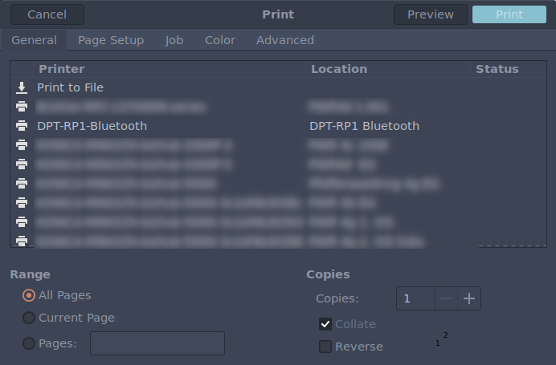

# DPT-RP1 CUPS backend

This CUPS backend allows to print directly to your DPT-RP1 or DPT-CP1 devices.
I took the idea from the equivalent backend for the [remarkable](https://github.com/ofosos/scratch/tree/master/remarkable-cups).
To use this you need to first install and configure [dpt-rp1-py](https://github.com/janten/dpt-rp1-py).


## Additional dependencies

* [notify-send.sh](https://github.com/vlevit/notify-send.sh)

# Installation

```bash
sudo make install
```

The backend assumes that your client-id and key files required by `dpt-rp1-py` are located at `~/.dpapp/deviceid.dat` and `~/.dpapp/privatekey.dat`, respectively.

To add a new DPT-RP1 as printer:

```bash
lpadmin -L 'DPT-RP1 WiFi' -D 'DPT-RP1 WiFi Printer' \
    -p 'DPT-RP1-WiFi' -E -v 'dptrp1:192.168.1.101'
```

Replace `192.168.1.101` with the correct address assigned to your DPT-RP1.
You can also give the corresponding bluetooth address.


